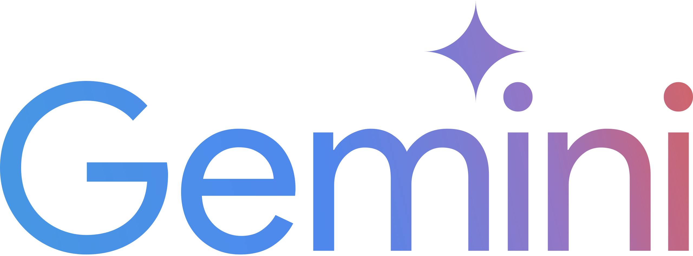
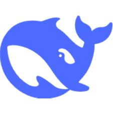

<div align="center">
    
</div>

<h1 align="center">Calyx: Standalone AIOps & Log Analyzer</h1>

</br>

<div align="center">A lightweight, AI-driven log management, event correlation, and alert rule builder.
</br>
</div>

<div align="center">
    <a href='http://makeapullrequest.com'>
      </a>
    <a href="https://github.com/thejynxx/Calyx/commits/main">
      </a>
</div>

<p align="center">
    <a href="#key-features">Key Features</a>
    ·
    <a href="#supported-ai-backends">AI Backends</a>
    ·
    <a href="#getting-started">Getting Started</a>
    ·
    <a href="#deployment">Deployment</a>
</p>

<div style="width: 100%; max-width: 800px; margin: 0 auto;">
    
</div>

<h1 align="center"></h1>

Calyx is an open-source, standalone AIOps and log analytics platform. Built on the core UI and database layouts of [Keep (keephq/keep)](https://github.com/keephq/keep), Calyx is engineered to be **lightweight, dependency-free, and serverless-friendly**. It bypasses heavy legacy databases, Keycloak auth, Redis caches, and message queues in favor of a single-file FastAPI engine and a local SQLite database.

## Key Features

- 🔍 **Single Pane AIOps Dashboard** - View rules, active alerts, and database statistics in a modern unified workspace.
- 🛠️ **Custom Rule Builder** - Define regex-based pattern matching or threshold-based sliding window rules directly in the UI.
- 🤖 **AI Correlation Center** - Group multiple alerts, identify root causes, and correlate alert sequences using Gemini or OpenAI.
- 📁 **Log Dataset Analyzer** - Drag-and-drop log uploader with JSON/Syslog parser, severity filters, and direct AI Insights.
- 🔐 **Credentials Login Authentication** - Secure NextAuth-backed login portal running database authentication directly connected to the FastAPI backend.
- ⚡ **Offline Fallback Mode** - Runs gracefully in pure browser memory (`localStorage`) if the custom backend is offline, allowing safe preview testing.

---

## Supported AI Backends

Calyx queries AI models directly using API keys you store privately in local browser settings.

<table>
<tr>
    <td align="center" width="150">
        <a href="https://aistudio.google.com/" target="_blank">
            <br/>
            Gemini
        </a>
    </td>
    <td align="center" width="150">
        <a href="https://platform.openai.com/" target="_blank">
            <br/>
            OpenAI
        </a>
    </td>
    <td align="center" width="150">
        <a href="https://www.anthropic.com/" target="_blank">
            <br/>
            Anthropic
        </a>
    </td>
    <td align="center" width="150">
        <a href="https://deepseek.com/" target="_blank">
            <br/>
            DeepSeek
        </a>
    </td>
    <td align="center" width="150">
        <a href="https://ollama.com/" target="_blank">
            <br/>
            Ollama
        </a>
    </td>
    <td align="center" width="150">
        <a href="https://x.ai/" target="_blank">
            <br/>
            Grok
        </a>
    </td>
</tr>
</table>

---

## Getting Started

Calyx is structured into a Python FastAPI backend and a Next.js (React) frontend.

### 1. Run the Python Backend
The backend parses ingested logs, tracks alert rules, and processes sign-in authentication.

```bash
cd aiops_backend
pip install -r requirements.txt
uvicorn main:app --port 8080 --reload
```

### 2. Run the Next.js Frontend
Start the local Next.js client pointing to the backend.

```bash
cd calyx/calyx-ui
npm install
npm run dev
```
Open `http://localhost:3000` to sign in. 
* Default Username: `admin`
* Default Password: `admin`

---

## Deployment

Calyx is cloud-native and serverless-friendly, making it extremely easy to publish:

### Deploying the Frontend (Vercel)
Connect your GitHub repository to Vercel and deploy.
* **Env Variables Required:**
  * `API_URL`: Point to your live FastAPI backend endpoint.
  * `NEXTAUTH_SECRET`: Generate a secure random key (`openssl rand -hex 32`).

### Deploying the Backend (Render/Railway/Fly.io)
Deploy the `aiops_backend` folder as a standard Python Web Service.
* **Env Variables (Optional):**
  * `CALYX_ADMIN_USERNAME`: Customize sign-in username.
  * `CALYX_ADMIN_PASSWORD`: Customize sign-in password.

---

## Credits & License
Calyx is built upon the robust dashboard templates, workflow components, and provider abstractions originally open-sourced by **[Keep (keephq/keep)](https://github.com/keephq/keep)**.

Licensed under the MIT License.
